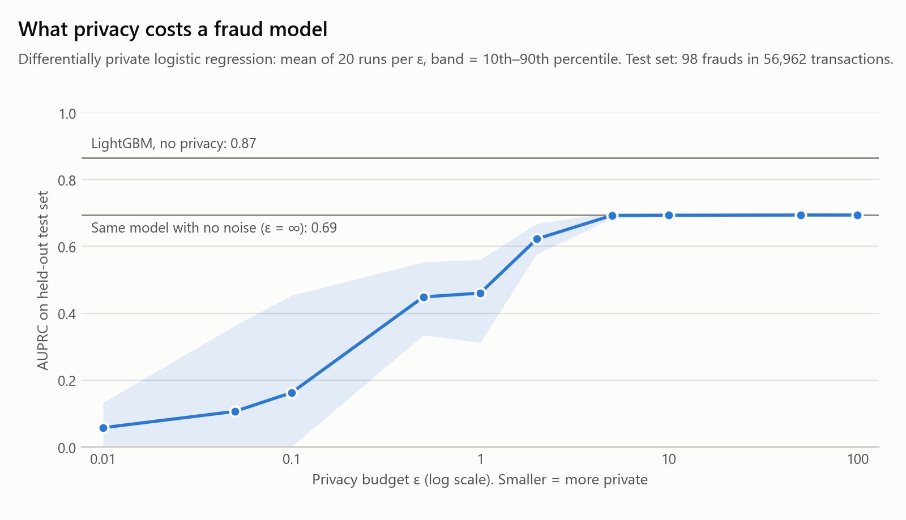
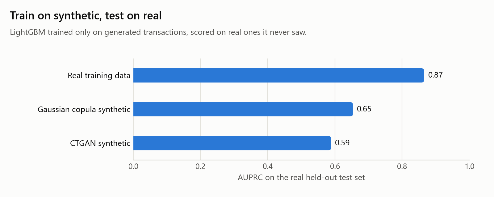
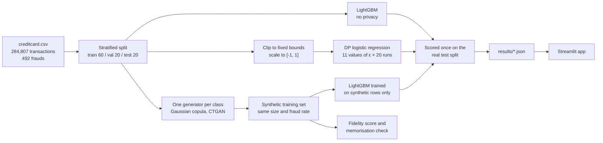

# Fraud Privacy Benchmark

[](https://github.com/Sayma-Sf/fraud-privacy-benchmark/actions/workflows/ci.yml)


[](https://fraud-privacy-benchmark.streamlit.app)

**How much fraud-detection accuracy does it cost to protect cardholders' privacy?**
This project measures that on 284,807 real card transactions, two ways: training the model
with **differential privacy**, and replacing the data with **synthetic data**.

**Live demo: [fraud-privacy-benchmark.streamlit.app](https://fraud-privacy-benchmark.streamlit.app)**.
Move the privacy slider and watch precision, recall and AUPRC respond. (On the free tier the
app sleeps when idle; if you see "get this app back up", it wakes in under a minute.)

<picture>
  <source media="(prefers-color-scheme: dark)" srcset="reports/figures/privacy_utility_dark.png">
  
</picture>

## Key findings

- **Privacy was nearly free down to ε = 5 for this model.** Differentially private logistic
  regression scores 0.693 AUPRC at ε = 5 and 0.694 with no noise at all. At ε = 2 it keeps 90%
  of that, and at ε = 1 two-thirds (0.46), still catching 62% of frauds.
- **Below ε = 0.5 the model becomes a lottery.** At ε = 0.1 the average is 0.16, but single
  training runs range from 0.00 to 0.45. You can't ship a model when you don't know which of those
  you'll get.
- **The model you can make private costs more than the privacy.** Going from LightGBM (0.865)
  to a logistic regression that DP can wrap costs 0.17 AUPRC before any noise is added, more than
  twice what ε = 2 then costs on top (0.07).
- **Synthetic data keeps recall but loses precision.** LightGBM trained only on Gaussian copula
  data scores 0.653 AUPRC (75% of the real-data model) and catches 83 of the 98 test frauds, as
  many as the real-data model. But it raises 264 alerts instead of 89, so precision drops from
  91% to 31%. An alert threshold tuned on synthetic data doesn't carry over to real traffic.
- **Higher fidelity didn't mean a more useful dataset.** CTGAN reproduces pairwise correlations
  better than the Gaussian copula (0.71 vs 0.59) yet trains a weaker model (0.589 vs 0.653).
- **No sign that either generator copied training rows.** 46–51% of synthetic rows sit closer to
  training rows than to unseen real rows (about 50% is the no-copying baseline), with zero exact
  copies. Synthetic rows also sit further from any real row than real rows sit from each other
  (median distance 0.48 vs 0.27), so they aren't near-copies, but they aren't perfectly
  realistic either.

The two routes protect different things. Differential privacy protects a **model** you release,
with a formal guarantee. Synthetic data releases a whole **dataset** that others can use for
anything, with only empirical evidence that it's safe.

## Results

Test split: 56,962 real transactions with 98 frauds, never used for training or tuning.
Accuracy ceiling: LightGBM on the real data scores **0.865 AUPRC** and catches 81 of the 98
frauds with 91% precision (89 alerts).

### Differential privacy: what each privacy level costs

| ε | Inference about one transaction can become, at most | Test AUPRC, mean ± sd of 20 runs | P10–P90 of runs | Kept vs no noise | Recall | Precision |
|---|---|---|---|---|---|---|
| ∞ (no privacy) | unbounded | 0.694 | | 100% | 84% | 80% |
| 10 | 22,026× | 0.693 ± 0.004 | 0.69–0.70 | 100% | 82% | 81% |
| 5 | 148× | 0.693 ± 0.007 | 0.68–0.70 | 100% | 82% | 81% |
| 2 | 7.39× | 0.622 ± 0.041 | 0.58–0.67 | 90% | 71% | 68% |
| 1 | 2.72× | 0.460 ± 0.094 | 0.31–0.56 | 66% | 62% | 57% |
| 0.5 | 1.65× | 0.449 ± 0.085 | 0.34–0.55 | 65% | 55% | 58% |
| 0.1 | 1.11× | 0.163 ± 0.171 | 0.00–0.45 | 23% | 26% | 27% |
| 0.01 | 1.01× | 0.058 ± 0.115 | 0.00–0.13 | 8% | 17% | 11% |

Recall and precision are averaged over the 20 runs, at each run's validation-chosen threshold. The
full grid (also ε = 0.05, 50 and 100) is in [`results/summary.json`](results/summary.json), and
every individual run is in [`results/dp_runs.csv`](results/dp_runs.csv).

### Synthetic data: train on synthetic, test on real

<picture>
  <source media="(prefers-color-scheme: dark)" srcset="reports/figures/synthetic_utility_dark.png">
  
</picture>

| Trained on | Test AUPRC | Recall | Precision | Fidelity: overall (column shapes / pair trends) | Rows closer to training data: all / fraud | Exact copies |
|---|---|---|---|---|---|---|
| Real training data | **0.865** | 83% | 91% | | | |
| Gaussian copula synthetic | 0.653 | 85% | 31% | 0.74 (0.89 / 0.59) | 49% / 51% | 0 |
| CTGAN synthetic | 0.589 | 84% | 34% | 0.77 (0.84 / 0.71) | 51% / 46% | 0 |

Fidelity is SDMetrics' quality score from 0 to 1. "Rows closer to training data" is the
memorisation check described below, where about 50% means no sign of copying.

## Why this data can never be shared

Everything a data team would want to learn from sits in the one dataset nobody is allowed to hand over.

- **It's regulated personal data.** These are European cardholders' transactions, so GDPR
  applies: every use needs a lawful basis and a stated purpose, and fines reach 4% of global
  annual turnover. Card data also falls under PCI DSS. In Saudi Arabia, the Personal Data
  Protection Law (PDPL) and the Saudi Central Bank's (SAMA) rules place the same limits on
  banks. None of them allows publishing raw transactions or passing them to an outside team
  or vendor just to build a model.
- **Removing names isn't anonymisation.** A few amounts and timestamps are enough to single out
  one cardholder. The public version of this dataset hides every original feature except time
  and amount behind a PCA transformation for exactly this reason.
- **It exposes how the bank catches fraud.** Labelled fraud cases show what gets flagged and
  what slips through. Published raw, they are a guide for fraudsters.

So the useful question isn't *"can we share it?"* but *"how much accuracy do we give up to learn
from it safely?"* That's what this benchmark measures.

## What ε (epsilon) means, in plain language

Picture two copies of the training data that are identical except one includes **your**
transaction. Differential privacy guarantees that the model trained on either copy comes out
almost the same, so nobody inspecting the model can tell whether your transaction was used.

**ε measures "almost".** Anything someone concludes about you from the model can become at most
**e<sup>ε</sup> times** more likely because your transaction was in the training set:

| ε | At most this much more likely | In words |
|---|---|---|
| 0.1 | 1.1× | Barely any information about one person gets out |
| 1 | 2.7× | Strong privacy |
| 5 | 148× | Moderate privacy |
| 10 | 22,026× | The formal guarantee is weak |
| ∞ | unbounded | No privacy guarantee: an ordinary model |

Smaller ε means more random noise during training, so more privacy and less accuracy. Here
the noise comes from [IBM diffprivlib](https://github.com/IBM/differential-privacy-library)'s
logistic regression, which uses *objective perturbation* (Chaudhuri et al., 2011): every
feature is clipped to fixed bounds, every row is scaled down to a length of at most 1 so one
transaction can't pull the model far, and calibrated noise is added to the training objective.

## How it works



Design choices that matter for the numbers:

- **AUPRC, not accuracy.** Fraud is 0.17% of transactions, so flagging nothing scores 99.83%
  accuracy. AUPRC (area under the precision-recall curve) starts at about 0.0017 for a random
  guess. Precision and recall are reported at the alert threshold that maximised F1 on the
  validation split.
- **Two reference points.** LightGBM is the accuracy ceiling. Logistic regression with no noise
  (ε = ∞, same clipping, same regularisation as diffprivlib) separates the *cost of a simpler
  model* from the *cost of privacy*.
- **20 runs per ε.** DP training is random, and at small ε two runs can land far apart. The table
  reports the mean and spread, not a lucky draw.
- **One generator per class.** With one fraud per ~580 legitimate rows, a single generator barely
  learns fraud. Each class gets its own [SDV](https://github.com/sdv-dev/SDV) generator, sampled
  back at the real fraud rate.
- **The recipient never sees real data.** The model trained on synthetic data does early stopping
  and threshold selection on a synthetic holdout. Real rows are used once, to score it.
- **Memorisation check.** For each synthetic row: is its nearest real neighbour in the training
  set, or in an equally sized set of real rows the generator never saw? About 50% means no
  sign of copying (distance to closest record, DCR).

## Limitations

- **Not all tuning is inside the privacy budget.** The row-clipping norm (from 5 candidates) and
  the feature bounds (from 4) were compared on the validation split, and the alert threshold is
  picked there too. A strict deployment would count that tuning against ε or fix these values from
  domain knowledge. ε covers the model weights only.
- **The synthetic data has no formal guarantee.** Gaussian copula and CTGAN aren't differentially
  private. The DCR check is evidence against copying, not proof. The natural next step is a
  DP generator such as DP-CTGAN or MST.
- **CPU-sized CTGAN.** It learned from 20,000 of the 170,883 legitimate training rows (plus every
  fraud) for 4,000 steps per class. More data and steps would likely improve it.
- **98 test frauds.** One or two frauds changing rank move AUPRC by a few hundredths, so small gaps
  between single models aren't meaningful.
- **Friendly features.** The data publisher already replaced raw features with PCA components.
  Real merchant, location and device fields are harder both to protect and to synthesise.

## Run it yourself

Python 3.11. From Git Bash on Windows (on macOS/Linux use `venv/bin/activate`):

```bash
python -m venv venv
source venv/Scripts/activate
python -m pip install -r requirements-pipeline.txt
python data/download.py          # Kaggle if ~/.kaggle/kaggle.json exists, else the OpenML mirror
python -m src.pipeline           # full benchmark, ~13 min on an 8-core laptop CPU
python -m pytest                 # 32 tests on synthetic stand-ins and committed results
ruff check .
python -m streamlit run app.py
```

`python -m src.pipeline --quick` runs the whole pipeline on a 30,000-row sample in about a minute.

> **Windows note.** Compiled packages are pinned to widely used early-2025 releases. With Windows
> Smart App Control on, brand-new wheels (for example scikit-learn 1.9 or pyarrow 25) fail with
> "An Application Control policy has blocked this file". These pinned versions load cleanly.

## Repository layout

```
fraud-privacy-benchmark/
├── app.py                    # Streamlit demo (reads results/ only)
├── data/download.py          # Kaggle or OpenML download, row and fraud count checks
├── notebooks/                # exploratory look at the data, not the deliverable
├── reports/figures/          # README charts, light and dark
├── results/                  # summary.json, pr_curves.json, dp_runs.csv (metrics only)
├── src/
│   ├── config.py             # seeds, splits, ε grid, generator budgets
│   ├── ingest/load.py        # schema checks, stratified split
│   ├── features/transform.py # features, fixed clipping bounds
│   ├── models/               # LightGBM baseline, AUPRC and threshold metrics
│   ├── privacy/              # DP sweep, synthetic generators, DCR memorisation check
│   ├── reporting/            # figures and app data helpers
│   └── pipeline.py           # runs everything end to end
├── tests/
├── requirements.txt          # demo runtime only (what Streamlit Cloud installs)
└── requirements-pipeline.txt # full stack for the benchmark and tests
```

Raw data is gitignored and never committed. `results/` holds aggregate metrics and curves only.

## Deploy the demo

1. Push this repo to GitHub.
2. On [share.streamlit.io](https://share.streamlit.io), create an app from the repo with main file
   `app.py` and Python 3.11 (under *Advanced settings*).
3. Streamlit Cloud installs `requirements.txt`: just Streamlit, Altair, pandas, NumPy and PyArrow,
   because the app reads precomputed metrics. No data, secrets or GPU needed.

## Data and references

- Dataset: [Credit Card Fraud Detection](https://www.kaggle.com/datasets/mlg-ulb/creditcardfraud),
  Machine Learning Group, Université Libre de Bruxelles, with Worldline. Mirrored on
  [OpenML (id 1597)](https://www.openml.org/d/1597). Please cite: A. Dal Pozzolo, O. Caelen,
  R. A. Johnson and G. Bontempi, *Calibrating Probability with Undersampling for Unbalanced
  Classification*, IEEE SSCI, 2015.
- K. Chaudhuri, C. Monteleoni and A. D. Sarwate, *Differentially Private Empirical Risk
  Minimization*, JMLR 12, 2011.
- N. Holohan, S. Braghin, P. Mac Aonghusa and K. Levacher, *Diffprivlib: The IBM Differential
  Privacy Library*, arXiv:1907.02444, 2019.
- N. Patki, R. Wedge and K. Veeramachaneni, *The Synthetic Data Vault*, IEEE DSAA, 2016.
- L. Xu, M. Skoularidou, A. Cuesta-Infante and K. Veeramachaneni, *Modeling Tabular Data using
  Conditional GAN*, NeurIPS, 2019.

## License

MIT, see [LICENSE](LICENSE). The dataset keeps its own license on Kaggle.
